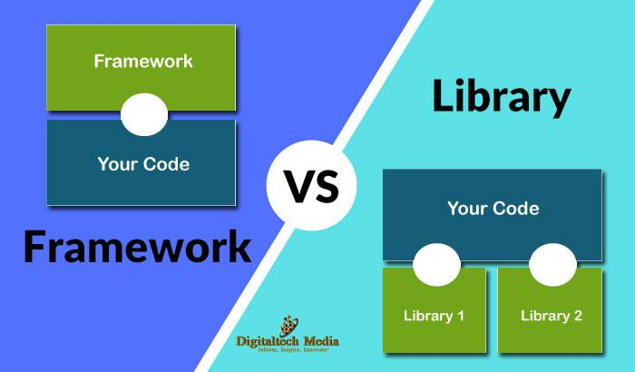
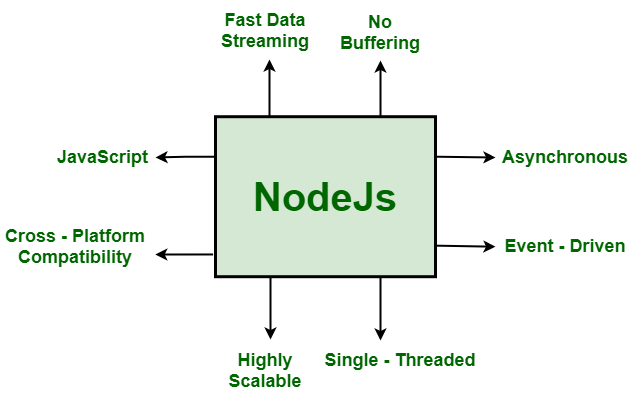
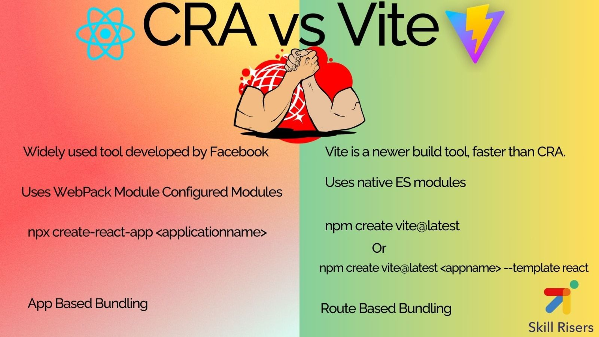
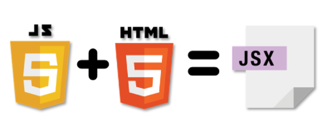

# Intrudaction to `React`
## What is React ?
React is a framework that employs Webpack to automatically compile React, JSX, and ES6 code while handling CSS file prefixes. React is a JavaScript-based UI development library. Although React is a library rather than a language, it is widely used in web development. The library first appeared in May 2013 and is now one of the most commonly used frontend libraries for web development.

## Why we learn React ?

* `Increased job opportunities:`
 React is a widely used technology, so learning it can open up many job opportunities for developers.

* `Higher earning potential:`
Due to the high demand for React developers, they often earn higher salaries compared to developers who work with other technologies.

* `Improved collaboration:`
React's component-based architecture makes it easier for developers to collaborate on projects. This can lead to more efficient teamwork, as well as better communication and coordination between team members. This can be especially important for large-scale projects or remote teams.

* `Faster development:`
React's virtual DOM and reusable components can help developers build applications faster, since they can reuse existing code and easily make changes without having to rebuild the entire application.

* `Better user experiences:`
React's performance and ability to render changes quickly can lead to better user experiences, which is increasingly important in today's market. Applications that provide a seamless user experience are more likely to be successful and gain traction with users.

* `Enhanced problem-solving skills:`
Learning React requires developers to think creatively and solve problems in new ways. This can improve their problem-solving skills and help them become better developers overall.

* `Access to a strong community:`
React has a large and active community, which can provide developers with support, resources, and opportunities for collaboration and networking. This community can be valuable for developers at all stages of their careers, from beginners who are just starting out to experienced professionals who want to stay up-to-date with the latest developments in React development.

## What is the differences between `Libraries and Framework`

* A framework is a set of pre-written code that provides a structure for developing software applications.

* A library, on the other hand, is a collection of pre-written code that can be used to perform specific tasks.

## What is `NodeJs` ?

Node.js is a cross-platform, open-source JavaScript runtime environment that can run on Windows, Linux, Unix, macOS, and more. Node.js runs on the V8 JavaScript engine, and executes JavaScript code outside a web browser.

## What is `NPM`

npm is the default `package manager` for the `JavaScript` runtime environment `Node.js`.

## What is `Vite and Create React App`

* `Vite.js:` Comes with a development server that supports Hot Module Replacement (HMR), enabling fast updates without a full page reload.

* `CRA:` Provides a development server with HMR support for React components, facilitating a smooth development experience.

## what is the differences between `Vite.js and CRA`

Choosing between Vite and Create React App (CRA) is pivotal in 2024. While CRA offers simplicity and strong React support, Vite stands out for speed and flexibility. Vite's quick build and hot reloading, along with multi-framework support, make it ideal for larger projects.

## What is a `Virtual DOM`

React JS Virtual DOM is an in-memory representation of the DOM. DOM refers to the Document Object Model that represents the content of XML or HTML documents as a tree structure so that the programs can be read, accessed and changed in the document structure, style, and content.

## What is `JSX`

JSX (JavaScript XML, formally JavaScript Syntax eXtension) is a JavaScript extension that allows creation of Document Object Model (DOM) trees using an XML-like syntax.[1] Initially created by Facebook for use with React, JSX has been adopted by multiple web frameworks.[2]: 5 [3]: 11  Being a syntactic sugar, JSX is generally transpiled into nested JavaScript function calls structurally similar to the original JSX.

